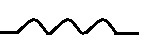

### Домашняя работа по предмету "GIT - система контроля версий."
Катушка индуктивности  
  

Будем рассчитывать реактивное сопротивление индуктивности в зависимости от:
- Индуктивности
- Частоты

    
    <h3 id="text"> Inductance Reactance table </h3>
    

        

            <label>Frequency start value (Hz)</label>  
            <input type="range" id="frequency_start_value_range" min="100" max="100000" value="100" step="10"/>    
            
            <label>Frequency values count (uH)</label>  
            <input type="range" id="frequency_values_count" min="1" max="35" value="5" step="1"/>    

            <label>Frequency step value (uH)</label>  
            <input type="range" id="frequency_step_value_range" min="1000" max="100000" value="100" step="100"/>    

            <label>Inductance start value (uH)</label>  
            <input type="range" id="inductance_start_value_range" min="10" max="1000" value="50" step="10"/>    
            
            <label>Inductance values count (uH)</label>  
            <input type="range" id="inductance_values_count" min="1" max="35" value="5" step="1"/>    

            <label>Inductance step value (uH)</label>  
            <input type="range" id="inductance_step_value_range" min="10" max="10000" value="50" step="10"/>    

        

        

        

    

    
    

